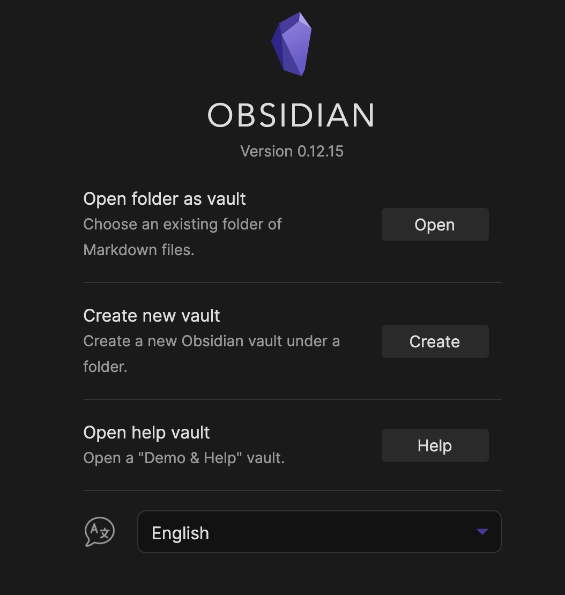
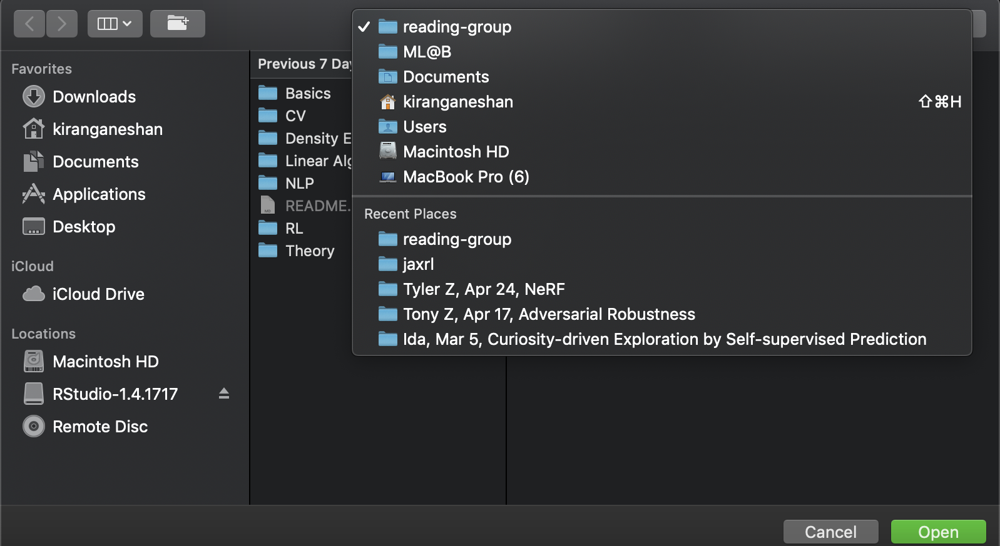
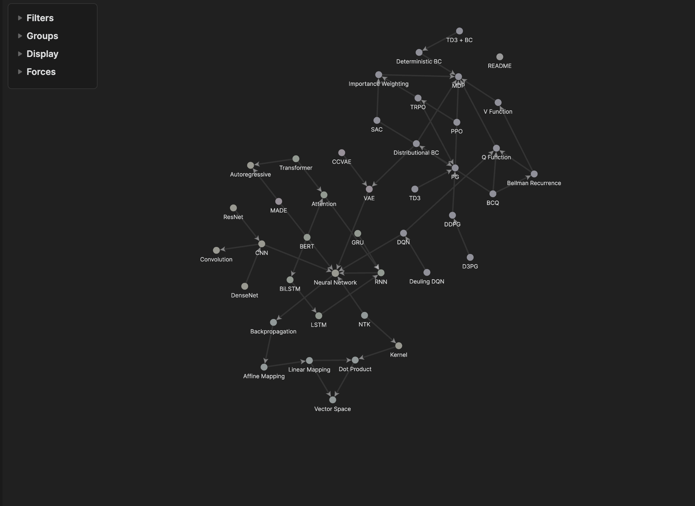
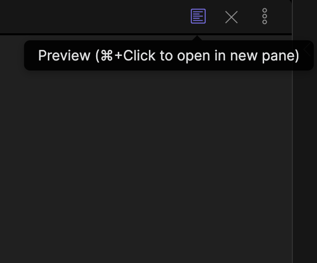

# Welcome
## If you're reading this from Github or your Markdown viewer:
Please follow the following steps to install the SHAI Research Vault. Then, read the section below the instructions in Obsidian.
1. Clone [this repository](https://github.com/kgshai/shai-reading-group) to a local folder
2. Download [Obsidian](https://obsidian.ml/)
3. Open Obsidian and click the “Open” button next to “Open folder as vault” 
4. Navigate to the folder you cloned the `shai-reading-group` repository into 
5. You should see the following graph in the Obsidian Graph Viewer 
8. Click the preview button in the top right corner with the Cmd (mac) or Ctrl (windows) button held (or whatever the obsidian popup says) to open a preview in a separate pane. Try adding the following the following and watch the preview update.
	1. A numbered list: "1. blah \n 2. blah" ->
		1. blah
		2. blah
	2. A bulleted list: "- blah \n - blah" ->
		- blah
		- blah
	3. In-text latex: "\$a = 1\$" -> $a = 1$
	4. Latex on its own line: "\$\$a = 1\$\$" -> $$a = 1$$
	5. An image, like the following one to help you find the preview pane: "!\[{Name} | {width}\]({path})" -> 
	"!\[Preview | 200\](Images/README/preview.png)" -> 
9. If you create something you'd like to be added to the master repository, create a pull request [on Github!](https://www.github.com/mlberkeley/reading-group/pulls)
## After Installing Obsidian:
Follow these steps to enable code execution in obsidian:
1. If you haven't already, [install Miniconda](https://docs.conda.io/projects/miniconda/en/latest/)
2. Open your command line terminal, navigate to `shai-reading-group`, and execute the following code, entering `y` as necessary to complete the operations
```
conda create -n rgpy python=3.9
conda activate rgpy
pip install -r requirements.txt
```
3. Open Obsidian Preferences (Obsidian > Settings..., or navigate to the command palate and find "Open settings")
4. Navigate to "Community Plugins", and if you see a screen asking if you'd like to exit restricted mode, click "Turn on community plugins" at the bottom
5. Under the "Community Plugins" submenu, click "Browse"
6. Search for the "Execute Code" plugin created by "twibiral" and click install
7. Search for the "Persistent Graph" plugin created by "Sanqui" and click install
8. Close the plugin browser and turn on both plugins under the "Installed Plugins" submenu
9. Click on the Options symbol (the gear) for the "Execute Code" plugin
10. In the drop-down list titled "Language-Specific Settings", select "Python"
11. Open your command line terminal and execute the following code, copying the output
```
conda activate rgpy
which python
```
12. Paste the output of the command from (11) in the field named "Python path"
## Universal Notation for LaTeX math
- $\mathcal{D}(v)$ refers to a distribution over the variable $v$
## Existing Plugin Features
- Save/reset node positions on the graph
- Execute Python code in a Jupyter Notebook-like style, displaying any plots produced
- Store node 
## Desired Plugin Features
- Make PersistentGraph work properly (currently quite buggy)
- Find a way to synchronize graph node positions so that everyone navigates the same planar representation of the graph


Zettelkasten methods
- write down interesting notes / highlights on slips
- assign prefixes to notes (generally, full prefix tree)
- 